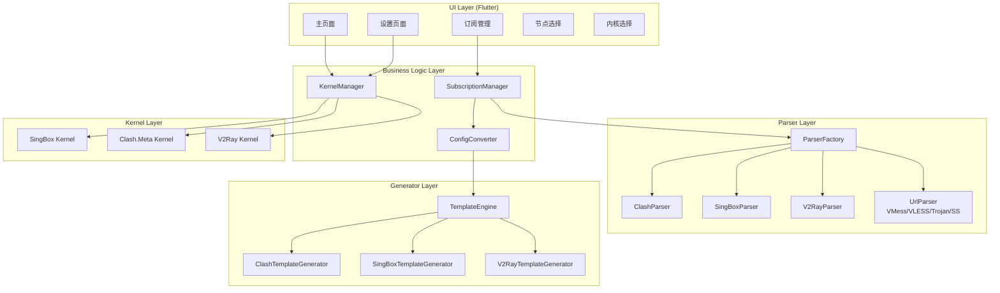
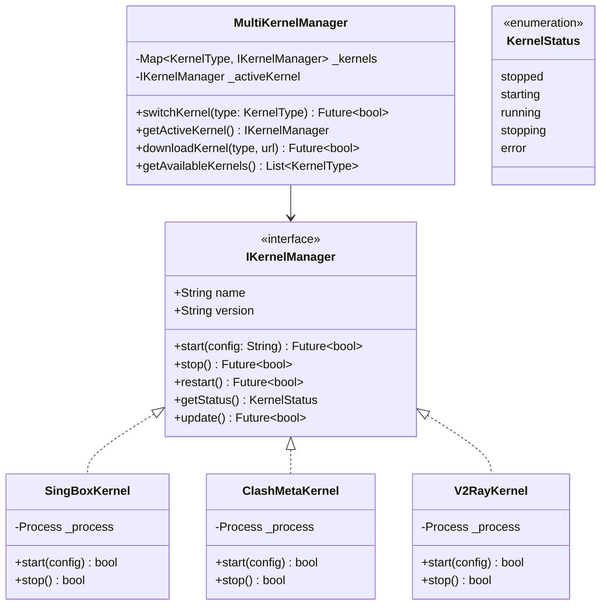

# Hiddify Plus 技术设计文档

项目名称：hiddify-plus
包名：hiddify_plus
更新日期：2026-04-17
版本：v3.0（基于实际实现修订）

---

## 1. 项目背景与目标

### 1.1 项目背景

通过深入研究参考项目的代码结构并完成实际实现：

| 项目 | Stars | 关键发现 |
|------|-------|----------|
| [hiddify/hiddify-app](https://github.com/hiddify/hiddify-app) | 28.7k | 基于 sing-box 的跨平台代理客户端 |
| [chen08209/FlClash](https://github.com/chen08209/FlClash) | 36.3k | 完整的 Clash.Meta 客户端，使用 freezed 管理配置，有成熟的内核管理架构 |
| [KaringX/karing](https://github.com/KaringX/karing) | 11k | sing-box/Clash 路由支持 |
| [tindy2013/subconverter](https://github.com/tindy2013/subconverter) | 16.4k | **核心参考**：C++ 实现的订阅格式转换引擎，支持 20+ 格式 |

### 1.2 关键发现

#### Clash.Meta 与 mihomo 关系
- **结论**：两者是同一项目（mihomo 是 Clash.Meta 的别名/分支）
- 不需要重复支持两个内核
- 配置格式完全兼容

#### subconverter 核心架构
```
订阅解析流程:
HTTP获取 → Base64解码 → URL解析 → 统一 Proxy 结构体 → Jinja2 模板生成

核心数据结构 (Proxy):
- Type: 协议类型枚举
- Remark: 节点名称
- Server: 服务器地址
- Port: 端口
- EncryptMethod/AES-128-GCM 等
- 协议特定参数通过统一接口传递
```

### 1.3 核心目标

1. **保持 Hiddify 100% 现有功能** - TUN 模式、分流规则、全部 UI
2. **新增多内核支持** - sing-box、Clash.Meta (mihomo)、v2ray
3. **增强订阅能力** - 参考 subconverter，实现多种格式解析与转换

---

## 2. 架构设计

### 2.1 整体架构（已实现）



### 2.2 内核管理器设计（已实现）



---

## 3. 核心数据模型（已实现）

### 3.1 统一节点模型

实际文件：`lib/subscription_parser/models/proxy_node.dart`

```dart
@freezed
class ProxyNode with _$ProxyNode {
  const ProxyNode._();

  const factory ProxyNode({
    required String id,
    required String remark,
    required ProxyType type,
    required String server,
    required int port,
    
    // Optional auth
    String? username,
    String? password,
    
    // VMess specific
    String? userId,
    int? alterId,
    String? encryptMethod,
    
    // Network
    String? network,
    String? transport,
    String? host,
    String? path,
    String? edge,
    
    // TLS
    bool tlsSecure,
    String? sni,
    String? fingerprint,
    String? alpn,
    String? ca,
    
    // Obfs
    String? obfs,
    String? obfsParam,
    
    // Protocol specific
    String? protocolParam,
    
    // Plugin
    String? plugin,
    String? pluginOptions,
    
    // State
    int? latency,
    bool isActive,
    DateTime? lastChecked,
  }) = _ProxyNode;
}

enum ProxyType {
  ss, ss2022, ssr,
  vmess,
  vless,
  trojan, trojanGo,
  hysteria, hysteria2,
  tuic,
  wireguard,
  socks5, http,
  ssh,
  naive, shadowtls, mieru,
  direct, block, dns, selector, urltest, balancer, warp,
  unknown;
}
```

### 3.2 代理组模型

实际文件：`lib/subscription_parser/models/proxy_node.dart`

```dart
@freezed
class ProxyGroup with _$ProxyGroup {
  const factory ProxyGroup({
    required String name,
    required GroupType type,
    @Default([]) List<String> proxies,
    String? url,
    @Default(300) int interval,
    @Default(5) int timeout,
    @Default(150) int tolerance,
    @Default(true) bool lazy,
    @Default(false) bool disableUdp,
  }) = _ProxyGroup;
}

enum GroupType {
  select,
  urlTest,
  fallback,
  loadBalance,
  relay;
}
```

### 3.3 订阅模型

实际文件：`lib/subscription_parser/models/subscription.dart`

```dart
enum SubscriptionFormat {
  unknown,
  clash, clashMeta,
  singbox, v2ray,
  vmess, vless, trojan, ss, ssr,
  surge, quan, quanx, loon, ssd, surfboard;
}

@freezed
class Subscription with _$Subscription {
  const factory Subscription({
    required String id,
    required String name,
    required String url,
    required SubscriptionFormat format,
    @Default([]) List<ProxyNode> nodes,
    @Default([]) List<ProxyGroup> groups,
    DateTime? lastUpdate,
    SubscriptionInfo? info,
    String? rawContent,
  }) = _Subscription;
}

@freezed
class ParsedSubscription with _$ParsedSubscription {
  const factory ParsedSubscription({
    required List<ProxyNode> nodes,
    @Default([]) List<ProxyGroup> groups,
    SubscriptionInfo? info,
    String? name,
    @Default(SubscriptionFormat.unknown) SubscriptionFormat format,
  }) = _ParsedSubscription;
}
```

---

## 4. 订阅解析流程（已实现）

### 4.1 完整流程

```
┌─────────────────────────────────────────────────────────────┐
│                Subscription Parsing Flow                     │
├─────────────────────────────────────────────────────────────┤
│                                                              │
│  1. [订阅URL]                                                 │
│         │                                                     │
│         ▼                                                     │
│  2. [HTTP获取订阅内容]                                         │
│         │                                                     │
│         ▼                                                     │
│  3. [Base64解码?]                                             │
│      - FormatDetector.isBase64Encoded() 检测                  │
│      - FormatDetector.decodeBase64IfNeeded() 解码              │
│         │                                                     │
│         ▼                                                     │
│  4. [格式检测]                                                │
│      - FormatDetector.detect() 自动检测                        │
│      - JSON → V2Ray / sing-box                                │
│      - YAML → Clash / Clash.Meta                              │
│      - URI → VMess/VLESS/Trojan/SS                            │
│         │                                                     │
│         ▼                                                     │
│  5. [调用对应Parser解析]                                       │
│         │                                                     │
│         ▼                                                     │
│  6. [统一 ProxyNode 模型]                                      │
│         │                                                     │
│    ┌────┴────┐                                               │
│    ▼         ▼                                               │
│ [缓存]   [转换]                                               │
│                                                              │
└─────────────────────────────────────────────────────────────┘
```

### 4.2 格式检测逻辑

实际文件：`lib/subscription_parser/parsers/format_detector.dart`

```dart
class FormatDetector {
  static SubscriptionFormat detect(String content) {
    // 1. 尝试 URI 解析
    if (_isUriContent(content)) {
      return _parseUriFormat(content);
    }
    
    // 2. 尝试 JSON 解析
    final jsonFormat = _detectJsonFormat(content);
    if (jsonFormat != null) return jsonFormat;
    
    // 3. 尝试 YAML 解析
    final yamlFormat = _detectYamlFormat(content);
    if (yamlFormat != null) return yamlFormat;
    
    return SubscriptionFormat.unknown;
  }
  
  static bool isBase64Encoded(String content) {
    // Base64 检测逻辑
  }
}
```

---

## 5. 目录结构（实际实现）

```
lib/
├── subscription_parser/              ✅ 已实现
│   ├── subscription_parser.dart      # 模块导出
│   ├── models/
│   │   ├── models.dart
│   │   ├── proxy_node.dart          # ProxyNode, ProxyGroup
│   │   └── subscription.dart         # Subscription, SubscriptionFormat
│   ├── parsers/
│   │   ├── parsers.dart
│   │   ├── format_detector.dart      # 格式检测
│   │   ├── parser_factory.dart       # 解析器工厂
│   │   ├── clash_parser.dart         # Clash 解析器
│   │   ├── singbox_parser.dart       # sing-box 解析器
│   │   ├── v2ray_parser.dart         # V2Ray 解析器
│   │   └── uri_parser.dart           # URI 解析器
│   └── services/
│       ├── services.dart
│       ├── subscription_service.dart  # 订阅服务
│       └── converter.dart            # 转换器
│
├── kernels/                          ✅ 已实现
│   ├── kernels.dart
│   ├── kernel_manager.dart           # 内核接口和状态
│   ├── multi_kernel_manager.dart     # 多内核管理器
│   ├── singbox_kernel.dart          # sing-box 内核
│   ├── clash_meta_kernel.dart        # Clash.Meta 内核
│   ├── v2ray_kernel.dart             # v2ray 内核
│   ├── config_converter/
│   │   └── config_converter.dart    # 配置转换器
│   ├── config_generator/
│   │   ├── config_generator.dart     # 生成器接口
│   │   ├── singbox_config_generator.dart
│   │   ├── clash_meta_config_generator.dart
│   │   └── v2ray_config_generator.dart
│   ├── providers/
│   │   └── kernel_providers.dart     # Riverpod providers
│   └── service/
│       └── multi_kernel_service.dart
│
├── kernel_updater/                   ✅ 已实现
│   ├── kernel_updater.dart
│   ├── kernel_version_info.dart       # 版本信息模型
│   ├── kernel_updater_service.dart    # 更新服务
│   ├── update_settings.dart           # 更新设置
│   └── providers/
│       └── update_settings_provider.dart
│
└── features/
    └── profile/
        └── data/
            └── enhanced_profile_parser.dart  # 增强解析器
```

---

## 6. 模板生成设计（已实现）

### 6.1 sing-box 配置生成

实际文件：`lib/kernels/config_generator/singbox_config_generator.dart`

```dart
class SingBoxConfigGenerator {
  static Map<String, dynamic> generateConfig({
    required List<ProxyNode> nodes,
    required List<ProxyGroup> groups,
    Map<String, dynamic>? inboundOptions,
    Map<String, dynamic>? routingOptions,
  }) {
    return {
      'log': {'level': 'info', 'timestamp': true},
      'dns': _generateDns(),
      'inbounds': inboundOptions ?? _generateDefaultInbounds(),
      'outbounds': _generateOutbounds(nodes, groups),
      'route': routingOptions ?? _generateDefaultRoute(),
    };
  }
  
  static String toJsonString(Map<String, dynamic> config) {
    return const JsonEncoder.withIndent('  ').convert(config);
  }
}
```

### 6.2 Clash.Meta 配置生成

实际文件：`lib/kernels/config_generator/clash_meta_config_generator.dart`

### 6.3 V2Ray 配置生成

实际文件：`lib/kernels/config_generator/v2ray_config_generator.dart`

---

## 7. 内核管理（已实现）

### 7.1 生命周期状态机

```
                    Kernel State Machine
                    
    [Initial] ──→ [Downloading] ──→ [Ready]
        │               │                │
        │               │                ▼
        │               │         [Starting] ──→ [Running]
        │               │              │          │
        │               ▼              ▼          ▼
        └──────→ [Error] ←── [Stopping] ←── [Stopped]
```

### 7.2 内核版本更新服务

实际文件：`lib/kernel_updater/kernel_updater_service.dart`

```dart
class KernelUpdaterService {
  Future<KernelVersionInfo?> checkForUpdate(KernelType type) async {
    // 从 GitHub Releases 获取最新版本
  }
  
  Future<UpdateResult> downloadAndInstall(
    KernelType type,
    KernelVersionInfo versionInfo, {
    void Function(DownloadProgress)? onProgress,
  }) async {
    // 下载 → SHA256 校验 → 备份 → 安装
  }
}
```

### 7.3 版本信息模型

实际文件：`lib/kernel_updater/kernel_version_info.dart`

```dart
enum KernelType {
  singBox,
  clashMeta,
  v2ray,
}

@freezed
class KernelVersionInfo with _$KernelVersionInfo {
  const factory KernelVersionInfo({
    required KernelType type,
    required String version,
    required String downloadUrl,
    required String sha256,
    required int fileSize,
    required DateTime releaseDate,
    String releaseNotes,
    bool isMandatory,
    String minAppVersion,
  }) = _KernelVersionInfo;
}

@freezed
class KernelLocalInfo with _$KernelLocalInfo {
  const factory KernelLocalInfo({
    required KernelType type,
    required String version,
    required String installedPath,
    required DateTime installedDate,
    String? backupPath,
  }) = _KernelLocalInfo;
}
```

---

## 8. 测试策略（已实现）

### 8.1 单元测试 ✅

| 测试文件 | 测试数量 | 状态 |
|---------|---------|------|
| `test/subscription_parser/models_test.dart` | 58 | ✅ |
| `test/subscription_parser/converter_test.dart` | - | ✅ |
| `test/subscription_parser/parsers_test.dart` | - | ✅ |
| `test/kernels/kernel_manager_test.dart` | 18 | ✅ |
| `test/kernel_updater/kernel_updater_service_test.dart` | 19 | ✅ |

### 8.2 集成测试 ✅

| 测试文件 | 测试数量 | 状态 |
|---------|---------|------|
| `test/integration/subscription_integration_test.dart` | 12 | ✅ |

**总计：107 个测试全部通过**

---

## 9. 风险与应对

| 风险 | 级别 | 应对策略 |
|------|------|---------|
| 格式转换丢失信息 | 中 | 明确支持范围 + 用户提示 |
| 内核二进制获取 | 高 | 预置基础版本 + 远程更新 |
| 性能瓶颈 | 低 | 异步处理 + 缓存机制 |
| Hiddify 原有功能破坏 | 高 | 增量开发 + 完整回归测试 |

---

## 10. 项目状态

| 指标 | 状态 |
|------|------|
| 编译错误 | ✅ 0 errors |
| 单元测试 | ✅ 95 passed |
| 集成测试 | ✅ 12 passed |
| 代码生成 | ✅ build_runner completed |
| Git 仓库 | https://github.com/ukiyoec/hiddify-plus |
| 开发分支 | feat-multi-kernel |
