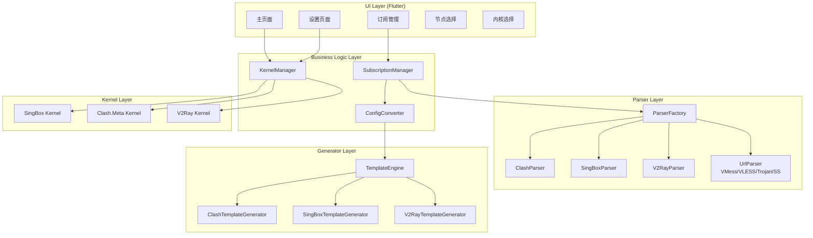
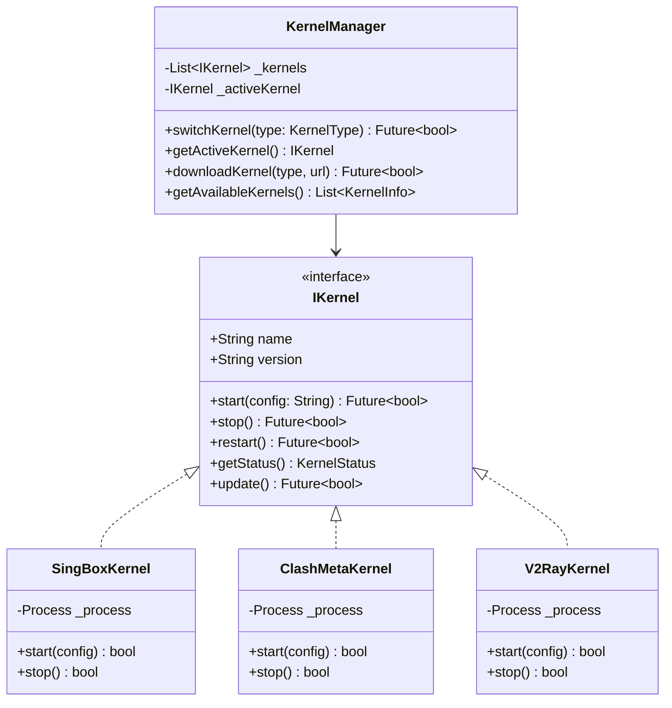
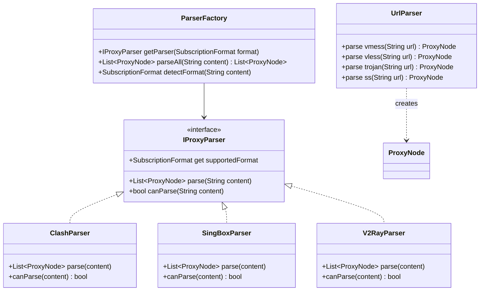
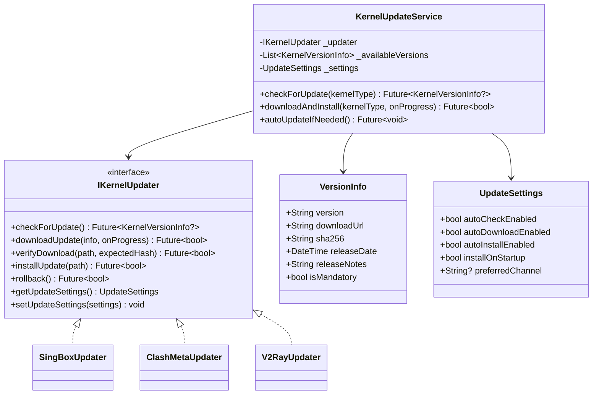

# Hiddify Enhanced 技术设计文档

项目名称：hiddify-enhanced
更新日期：2026-04-17
版本：v2.0（基于代码研究修订）

---

## 1. 项目背景与目标

### 1.1 项目背景

通过深入研究参考项目的代码结构：

| 项目 | Stars | 关键发现 |
|------|-------|----------|
| [hiddify/hiddify-app](https://github.com/hiddify/hiddify-app) | 28.7k | 基于 sing-box 的跨平台代理客户端 |
| [chen08209/FlClash](https://github.com/chen08209/FlClash) | 36.3k | 完整的 Clash.Meta 客户端，使用 freezed 管理配置，有成熟的内核管理架构 |
| [KaringX/karing](https://github.com/KaringX/karing) | 11k | sing-box/Clash 路由支持 |
| [tindy2013/subconverter](https://github.com/tindy2013/subconverter) | 16.4k | **核心参考**：C++ 实现的订阅格式转换引擎，支持 20+ 格式 |

### 1.2 关键发现

#### Clash.Meta 与 mihomo 关系
- **结论**：两者是同一项目（mihomo 是 Clash.Meta 的别名/分支）
- 不需要重复支持两个内核
- 配置格式完全兼容

#### subconverter 核心架构
```
订阅解析流程:
HTTP获取 → Base64解码 → URL解析 → 统一 Proxy 结构体 → Jinja2 模板生成

核心数据结构 (Proxy):
- Type: 协议类型枚举
- Remark: 节点名称
- Server: 服务器地址
- Port: 端口
- EncryptMethod/AES-128-GCM 等
- 协议特定参数通过统一接口传递
```

### 1.3 核心目标

1. **保持 Hiddify 100% 现有功能** - TUN 模式、分流规则、全部 UI
2. **新增多内核支持** - sing-box、Clash.Meta (mihomo)、v2ray
3. **增强订阅能力** - 参考 subconverter，实现多种格式解析与转换

---

## 2. 架构设计

### 2.1 整体架构



### 2.2 内核管理器设计



### 2.3 订阅解析器设计

参考 subconverter 的统一 Proxy 结构，设计 Dart 版本的解析器架构：



---

## 3. 核心数据模型

### 3.1 统一节点模型（参考 subconverter Proxy）

```dart
class ProxyNode {
    final String id;                    // UUID
    final String remark;                // 节点名称
    final ProxyType type;               // 协议类型
    final String server;                // 服务器地址
    final int port;                     // 端口
    final String? username;             // 用户名
    final String? password;             // 密码
    
    // 协议特定参数 (参考 subconverter 的统一结构)
    final String? userId;               // VMess userId
    final int? alterId;                 // VMess alterId
    final String? encryptMethod;        // 加密方式
    final String? transferProtocol;     // 传输协议 (tcp/ws/http/quic)
    final String? host;                 // Host 头
    final String? path;                 // 路径
    final String? edge;                 // VMess edge
    final bool tlsSecure;               // TLS 是否启用
    final String? sni;                  // SNI
    final String? fingerprint;          // TLS 指纹
    final String? alpn;                // ALPN
    
    // 底层代理 (用于代理链)
    final String? underlyingProxy;
    
    // 状态
    final int? latency;                 // 延迟 ms
    final bool isActive;
    final DateTime? lastChecked;
}

enum ProxyType {
    // VMess 系列
    vmess,
    
    // VLESS
    vless,
    
    // Trojan 系列
    trojan,
    trojanGo,
    
    // Shadowsocks 系列
    ss,
    ss2022,
    ssr,
    
    // Hysteria 系列
    hysteria,
    hysteria2,
    
    // TUIC
    tuic,
    
    // WireGuard
    wireguard,
    
    // SOCKS/HTTP
    socks5,
    http,
    
    // SSH
    ssh,
}
```

### 3.2 代理组模型（参考 subconverter ProxyGroupConfig）

```dart
class ProxyGroup {
    final String name;
    final GroupType type;
    final List<String> proxies;
    final String? url;              // url-test 用
    final int interval;              // 测试间隔 (秒)
    final int timeout;               // 超时 (秒)
    final int tolerance;            // 延迟容差 (ms)
    final bool lazy;
    final bool disableUdp;
}

enum GroupType {
    select,       // 手动选择
    urlTest,      // 自动测试选择
    fallback,    // 故障切换
    loadBalance, // 负载均衡
    relay,       // 链式代理
}
```

### 3.3 订阅模型

```dart
class Subscription {
    final String id;
    final String name;
    final String url;
    final SubscriptionFormat format;
    final DateTime? lastUpdate;
    final int? expireDays;
    final int? totalTraffic;
    final int? usedTraffic;
    final List<ProxyNode> nodes;
    final List<ProxyGroup> groups;
}

enum SubscriptionFormat {
    clash,
    clashMeta,
    singbox,
    v2ray,
    surge,
    quan,
    quanx,
    loon,
    ss,
    sssub,
    ssd,
    ssr,
    surfboard,
    vmess,    // 仅作为来源
    vless,    // 仅作为来源
    trojan,   // 仅作为来源
    unknown,
}
```

---

## 4. 订阅解析流程（参考 subconverter）

### 4.1 完整流程

```
┌─────────────────────────────────────────────────────────────┐
│                Subscription Parsing Flow                     │
├─────────────────────────────────────────────────────────────┤
│                                                              │
│  1. [订阅URL]                                                 │
│         │                                                     │
│         ▼                                                     │
│  2. [HTTP获取订阅内容]                                         │
│         │                                                     │
│         ▼                                                     │
│  3. [Base64解码?                                              │
│      - 检测是否 Base64 编码                                    │
│      - 是则解码，否则直接使用                                   │
│         │                                                     │
│         ▼                                                     │
│  4. [格式检测                                                 │
│      - 尝试 JSON 解析 → V2Ray / sing-box                      │
│      - 尝试 YAML 解析 → Clash / Clash.Meta                     │
│      - 尝试 URI 解析 → VMess/VLESS/Trojan/SS                  │
│         │                                                     │
│         ▼                                                     │
│  5. [调用对应Parser解析]                                       │
│         │                                                     │
│         ▼                                                     │
│  6. [统一 ProxyNode 模型]                                      │
│         │                                                     │
│    ┌────┴────┐                                               │
│    ▼         ▼                                               │
│ [缓存]   [转换]                                               │
│    │         │                                               │
│    │         ▼                                               │
│    │   7. [加载目标格式模板]                                   │
│    │         │                                               │
│    │         ▼                                               │
│    │   8. [渲染生成目标配置]                                   │
│    │         │                                               │
│    │         ▼                                               │
│    │   9. [交给内核管理器]                                     │
│    │                                                           │
│    └───────→ [存储到本地]                                      │
│                                                              │
└─────────────────────────────────────────────────────────────┘
```

### 4.2 格式检测逻辑（参考 subconverter）

```dart
SubscriptionFormat detectFormat(String content) {
  // 1. 尝试 URI 解析 (VMess/VLESS/Trojan/SS 等)
  if (content.startsWith('vmess://') ||
      content.startsWith('vless://') ||
      content.startsWith('trojan://') ||
      content.startsWith('ss://')) {
    return _parseUri(content);
  }
  
  // 2. 尝试 JSON 解析
  try {
    final json = jsonDecode(content);
    if (json['protocol'] == 'vmess') return SubscriptionFormat.v2ray;
    if (json.containsKey('log')) return SubscriptionFormat.singbox;
    if (json.containsKey('inbounds')) return SubscriptionFormat.v2ray;
  } catch (_) {}
  
  // 3. 尝试 YAML 解析
  try {
    final yaml = loadYaml(content);
    if (yaml['proxies'] != null) {
      if (yaml['dns'] != null) return SubscriptionFormat.singbox;
      if (yaml[' Clash'] != null || yaml['Proxy'] != null) return SubscriptionFormat.clash;
      if (yaml['proxy-groups'] != null) return SubscriptionFormat.clashMeta;
    }
  } catch (_) {}
  
  return SubscriptionFormat.unknown;
}
```

---

## 5. 目录结构设计

```
lib/
├── main.dart
├── app.dart
├── core/
│   ├── constants/
│   │   ├── app_constants.dart
│   │   └── kernel_constants.dart
│   ├── errors/
│   │   └── exceptions.dart
│   ├── utils/
│   │   ├── logger.dart
│   │   ├── network_utils.dart
│   │   └── base64_utils.dart
│   └── extensions/
│       └── string_extensions.dart
├── data/
│   ├── datasources/
│   │   ├── local/
│   │   │   └── database.dart
│   │   └── remote/
│   │       └── subscription_api.dart
│   ├── models/
│   │   ├── proxy_node.dart
│   │   ├── subscription.dart
│   │   ├── proxy_group.dart
│   │   └── kernel_config.dart
│   └── repositories/
│       ├── kernel_repository.dart
│       ├── subscription_repository.dart
│       └── config_repository.dart
├── domain/
│   ├── entities/
│   ├── repositories/
│   └── usecases/
├── presentation/
│   ├── pages/
│   ├── widgets/
│   └── providers/
├── kernels/
│   ├── base/
│   │   ├── i_kernel.dart
│   │   └── kernel_manager.dart
│   ├── singbox/
│   │   └── singbox_kernel.dart
│   ├── clash_meta/
│   │   └── clash_meta_kernel.dart
│   └── v2ray/
│       └── v2ray_kernel.dart
└── parsers/
    ├── base/
    │   ├── i_parser.dart
    │   └── parser_factory.dart
    ├── clash/
    │   └── clash_parser.dart
    ├── singbox/
    │   └── singbox_parser.dart
    ├── v2ray/
    │   └── v2ray_parser.dart
    └── uri/
        └── uri_parser.dart
```

---

## 6. 模板生成设计（参考 subconverter Jinja2）

### 6.1 Clash 模板片段

```yaml
# Clash 配置模板
mixed-port: {{mixed_port}}
allow-lan: {{allow_lan}}
mode: {{mode}}
external-controller: {{external_controller}}

proxy-groups:

  - name: {{ group.name }}
    type: {{ group.type }}
    
    url: {{ group.url }}
    interval: {{ group.interval }}
    
    proxies:
    
      - {{ proxy }}
    


proxies:

  - name: {{ node.remark }}
    type: {{ node.type }}
    server: {{ node.server }}
    port: {{ node.port }}
    
    password: {{ node.password }}
    
    
    cipher: {{ node.encryptMethod }}
    
    # ... 其他参数

```

---

## 7. 内核管理

### 7.1 生命周期

```
                    Kernel State Machine
                    
    [Initial] ──→ [Downloading] ──→ [Ready]
        │               │                │
        │               │                ▼
        │               │         [Starting] ──→ [Running]
        │               │              │          │
        │               ▼              ▼          ▼
        └──────→ [Error] ←── [Stopping] ←── [Stopped]
```

### 7.2 内核版本更新服务



### 7.3 版本检测与更新流程

```
┌─────────────────────────────────────────────────────────────┐
│                 Kernel Update Flow                            │
├─────────────────────────────────────────────────────────────┤
│                                                              │
│  1. [启动/手动检查]                                           │
│         │                                                     │
│         ▼                                                     │
│  2. [获取当前内核版本]                                        │
│         │                                                     │
│         ▼                                                     │
│  3. [请求版本服务器]                                           │
│     GET /api/v1/kernels/{type}/latest                        │
│         │                                                     │
│         ▼                                                     │
│  4. [比对版本信息]                                            │
│         │                                                     │
│    ┌────┴────┐                                               │
│    ▼         ▼                                               │
│ [有新版本] [已是最新]                                          │
│    │         │                                               │
│    ▼         ▼                                               │
│ 5. [下载新版本] 结束                                           │
│    │         │
│    ▼         │
│ 6. [SHA256校验]                                               │
│    │         │
│    ▼         │
│ 7. [备份当前版本]                                              │
│    │         │
│    ▼         │
│ 8. [安装新版本]                                               │
│    │         │
│    ▼         │
│ 9. [验证安装]                                                  │
│    │         │
│    ▼         │
│ [成功] ──→ [完成]                                             │
│    │                                                         │
│ [失败] ──→ [回滚] ──→ [提示用户]                               │
│                                                              │
└─────────────────────────────────────────────────────────────┘
```

### 7.4 内核版本信息存储

```dart
class KernelVersionInfo {
    final KernelType type;           // 内核类型
    final String version;             // 版本号 (如 1.8.0)
    final String downloadUrl;         // 下载地址
    final String sha256;             // SHA256 校验和
    final int fileSize;              // 文件大小 (bytes)
    final DateTime releaseDate;      // 发布日期
    final String releaseNotes;       // 发布说明
    final bool isMandatory;          // 是否强制更新
    final String minAppVersion;      // 最低支持 App 版本
}

class KernelLocalInfo {
    final KernelType type;           // 内核类型
    final String version;             // 当前版本
    final String installedPath;       // 安装路径
    final DateTime installedDate;     // 安装日期
    final String? backupPath;         // 备份路径
}
```

### 7.5 更新设置

```dart
enum UpdateChannel {
    stable,    // 稳定版
    beta,      // 测试版
    dev,       // 开发版
}

class UpdateSettings {
    final bool autoCheckEnabled;      // 自动检查更新
    final bool autoDownloadEnabled;   // 自动下载更新
    final bool autoInstallEnabled;    // 自动安装更新
    final bool installOnStartup;      // 启动时安装
    final UpdateChannel channel;      // 更新通道
    final Duration checkInterval;     // 检查间隔
}
```

### 7.2 配置隔离策略

- 每个内核维护独立的配置文件
- 配置存储在 `~/.config/hiddify-{kernel}/` 目录
- 切换内核时自动复制对应配置

---

## 8. 测试策略

### 8.1 单元测试
- 各 Parser 的格式解析正确性
- 格式转换完整性（round-trip 测试）
- KernelManager 状态机

### 8.2 集成测试
- 订阅获取-解析-转换完整流程
- 内核启动-运行-停止生命周期
- 多内核切换的配置迁移

---

## 9. 风险与应对

| 风险 | 级别 | 应对策略 |
|------|------|----------|
| 格式转换丢失信息 | 中 | 明确支持范围 + 用户提示 |
| 内核二进制获取 | 高 | 预置基础版本 + 远程更新 |
| 性能瓶颈 | 低 | 异步处理 + 缓存机制 |
| Hiddify 原有功能破坏 | 高 | 增量开发 + 完整回归测试 |
